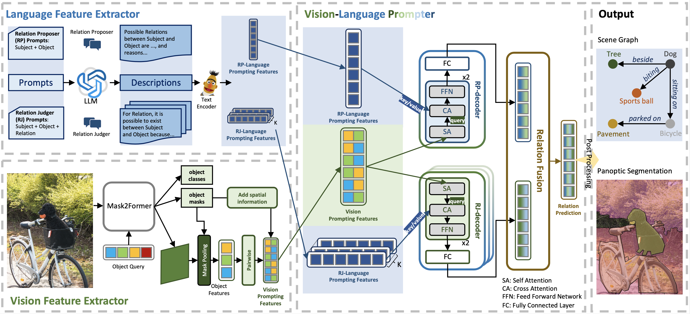

# VLPrompt: Vision-Language Prompting for Panoptic Scene Graph Generation

Official code implementation of VLPrompt, [arXiv](https://arxiv.org/abs/2311.16492). Stay tuned.

## Abstract
Panoptic Scene Graph Generation (PSG) aims at achieving a comprehensive image understanding by simultaneously segmenting objects and predicting relations among objects.
However, the long-tail problem among relations leads to unsatisfactory results in real-world applications.
Prior methods predominantly rely on vision information or utilize limited language information, such as object or relation names, thereby overlooking the utility of language information. 
Leveraging the recent progress in Large Language Models (LLMs), we propose to use language information to assist relation prediction, particularly for rare relations.
To this end, we propose the Vision-Language Prompting (VLPrompt) model, which acquires vision information from images and language information from LLMs.
Then, through a prompter network based on attention mechanism, it achieves precise relation prediction.
Our extensive experiments show that VLPrompt significantly outperforms previous state-of-the-art methods on the PSG dataset, proving the effectiveness of incorporating language information and alleviating the long-tail problem of relations.

## Method

The overall framework of our VLPrompt method, which comprises three components: the vision feature extractor, the language feature extractor and the vision-language prompter.

## Results

Comparison between our VLPrompt and other methods on the PSG dataset. Our method shows superior performance compared to all previous methods.

## Visualization

Visualization results of our VLPrompt.
We show two examples.
For each example, the top left displays the predicted segmentation results, the top right shows the top 10 predicted relation triplets (all are correct relation triplets), and bottom is the language snippet utilized for predicting the highlighted triplets in yellow.

## Citation
```
@article{zhou2023vlprompt,
  title={VLPrompt: Vision-Language Prompting for Panoptic Scene Graph Generation},
  author={Zhou, Zijian and Shi, Miaojing and Caesar, Holger},
  journal={arXiv preprint arXiv:2311.16492},
  year={2023}
}
```
